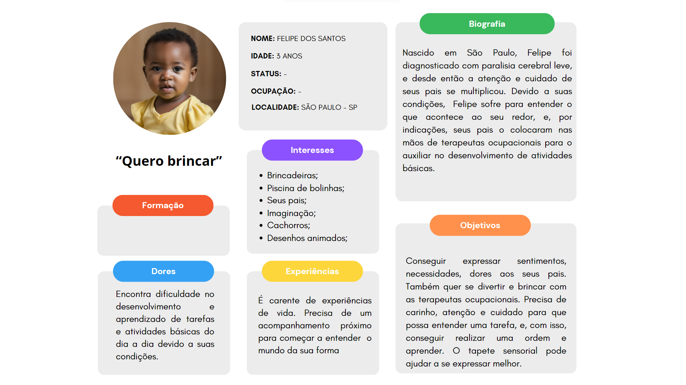

# Entendimento da Experiência do Usuário

## Personas

A Persona é uma ferramenta central no design centrado no usuário, servindo como uma representação fictícia de um segmento do usuário final. Ao criar uma persona, você humaniza seus dados de pesquisa, oferecendo um rosto, nome e background para seu público-alvo, facilitando assim a tomada de decisões centradas no usuário. A Persona deve ser baseada em dados reais e pesquisas com usuários para garantir sua eficácia.

Dessa forma, as personas envolvidas no projeto em desenvolvimento são: **terapeuta ocupacional** e **paciente**, vistos nas seguintes imagens:

Imagem 1: representação da criança - paciente do tratamento com o tapete sensorial.

Imagem 2: representação da Terapeuta Ocupacional (T.O.), profissional que utiliza o tapete sensorial.

## Mapas de Jornada dos Usuários

O Mapa de Jornada do Usuário é uma ferramenta visual que retrata a sequência de interações que um usuário tem com um produto ou serviço. Ele fornece uma narrativa clara e organizada das experiências, sentimentos, pontos de dor e pontos de satisfação de um usuário ao longo de um processo. Esta ferramenta é essencial para identificar oportunidades de melhoria e otimização da experiência do usuário.

Por isso, elaborou-se o mapa da jornada de ambas as personas presentes no projeto, o mapa da **Terapeuta Ocupacional** e o mapa da **criança**, como pode-se ver nas representações a seguir:

Imagem 3: representação da jornada do Paciente no momento de tratamento com o tapete sensorial.

Imagem 4: representação da jornada da T.O., ao utilizar o tapete sensorial em sua sessão de terapia ocupacional.

## User Stories

As "User Stories" são uma técnica utilizada em métodos ágeis para capturar requisitos de software do ponto de vista do usuário. São declarações concisas de um desejo ou necessidade do usuário. A metodologia INVEST é um conjunto de critérios usados para garantir que uma User Story seja bem definida e útil. INVEST é um acrônimo para Independent, Negotiable, Valuable, Estimable, Small e Testable.

Sendo assim, a seguinte tabela expressa o direcionamento dos requisitos a serem desenvolvidos na presente aplicação web:

| Épico    | Prioridade | Complexidade (Fibonacci)| User Story | Status   |
| -------- |:--------:  | :-------------------:| -----------| :--------: |
| Cadastro |     10     | 1                    | Eu, como T.O., quero fazer login na plataforma Cognito para que possa programar o tapete sensorial | Em desenvolvimento |
| Cadastro |     9      | 1                    | Eu, como T.O., quero colocar na plataforma Cognito dados como nome, idade, gênero, e demais dados demográficos para que possa cadastrar um perfil para cada paciente | Em desenvolvimento |
| Visualização Paciente | 9 | 8                | Eu, como T.O., quero acessar a aba "pacientes" e ver todos os meus pacientes em forma de lista, para que possa ter uma visualização simples e dinâmica | Em desenvolvimento |
| Visualização Paciente | 9 | 5                | Eu, como T.O., quero selecionar um perfil individual de um paciente, para que possa realizar a programação do tapete sensorial para aquela sessão de terapia | Em desenvolvimento |
| Programação | 10      | 13                   | Eu, como T.O., quero visualizar uma interface de programação do tapete em forma de blocos, para que eu possa rapidamente e facilmente programar uma sessão de terapia | Em desenvolvimento |
| Programação | 10      | 13                   | Eu, como T.O., quero relacionar um feedback sonoro com um quadrado do tapete sensorial que o paciente vai clicar, para que possa ensinar o paciente sobre a relação do som com a textura | Em desenvolvimento |
| Programação | 10      | 13                   | Eu, como T.O., quero relacionar um feedback visual, como uma imagem, com um quadrado do tapete sensorial que o paciente vai clicar, para que possa ensinar o paciente sobre a relação da imagem com a textura | Em desenvolvimento |
| Programação | 9       | 13                   | Eu, como T.O., quero configurar o tapete sensorial de forma que possa adicionar uma imagem a um bloco de configuração, para que eu controle exatamente o que o sistema mostrará ao paciente ao encostar no quadrante correto do tapete | Em desenvolvimento |
| Programação | 10      | 5                    | Eu, como T.O., quero colocar uma cor no bloco de programação do tapete sensorial, para que possa criar uma relação de uma cor com uma textura | Em desenvolvimento |
| Programação | 10      | 21                   | Eu, como T.O., quero ter a minha disposição uma configuração padrão de algum jogo com o tapete sensorial que eu possa usar em minha terapia de forma padronizada, como um conto dos 3 porquinhos, para que eu possa otimizar meu tempo na sessão de terapia | Em desenvolvimento |
| Programação | 10      | 8                    | Eu, como T.O., quero salvar a configuração que fiz no tapete sensorial com os blocos, para que eu possa utilizar o mesmo modelo de história em outras sessões futuras de terapia | Em desenvolvimento |
| Programação | 10      | 13                   | Eu, como T.O., quero enviar a configuração do tapete sensorial para o Greg Maker somente apertando o botão "play" na plataforma, para que possa começar a sessão de terapia | Em desenvolvimento |
| Terapia | 10          | 2                    | Eu, como T.O., quero que o sistema dê um feedback positivo em caso do paciente acertar o comando que o dei, como clicar no quadrante verde com barbante e o sistema mostrar o som e imagem de uma ovelha, para que o paciente fique feliz e reconheça seu acerto | Em desenvolvimento |
| Terapia | 10          | 1                    | Eu, como T.O., quero que o sistema não dê um feedback negativo em caso do paciente errar o comando que dei, para que possa, pessoalmente, direcionar o acerto de acordo com o perfil do paciente | Em desenvolvimento |
| Terapia | 10          | 21                   | Eu, como T.O., quero salvar os dados de acertos e erros de um paciente durante uma sessão de terapia em um relatório, para que possa analisar seu desempenho em detalhes | Em desenvolvimento |
| Terapia | 10          | 21                   | Eu, como T.O,, quero visualizar a evolução de um paciente ao acessar os dados de todas suas sessões de terapia utilizando o tapete sensorial, para que possa direcionar seu tratamento de forma específica e pessoal | Em desenvolvimento |
| Criança | 10          | 13                   | Eu, como criança, quero interagir com o tapete sensorial para explorar sensações táteis e visuais, tornando a terapia uma experiência envolvente e divertida | Em desenvolvimento |
| Criança | 10          | 2                    | Eu, como criança, desejo tocar o tapete sensorial nos quadrantes correspondentes às cores e texturas para desfrutar de estímulos sensoriais agradáveis e recompensadores | Em desenvolvimento |
| Criança | 10          | 13                   | Eu, como criança, quero ouvir sons suaves e agradáveis quando toco nas áreas corretas do tapete sensorial, para aprender a associação entre som e ações corretas | Em desenvolvimento |
| Criança | 10          | 13                   | Eu, como criança, desejo ver imagens relacionadas aos quadrantes tocados no tapete sensorial, para entender visualmente as conexões entre cores, texturas e figuras | Em desenvolvimento |
| Criança | 10          | 2                    | Eu, como criança, desejo receber feedback positivo, como elogios e recompensas visuais e sonoras, quando realizar ações corretas no tapete sensorial, para me sentir motivado e reforçar meu aprendizado | Em desenvolvimento |
| Criança | 10          | 1                    | Eu, como criança, não quero receber feedback negativo ao cometer erros no tapete sensorial, para manter um ambiente terapêutico positivo e encorajador | Em desenvolvimento |
| Criança | 10          | 21                   | Eu, como criança, quero sentir-me mais independente e confiante em minhas habilidades através do uso do tapete sensorial, melhorando meu desempenho em atividades do dia a dia | Em desenvolvimento |
| Criança | 10          | 21                   | Eu, como criança, desejo que meus progressos e desempenho nas sessões com o tapete sensorial sejam registrados e analisados para direcionar o tratamento de acordo com minhas necessidades e conquistas | Em desenvolvimento | 