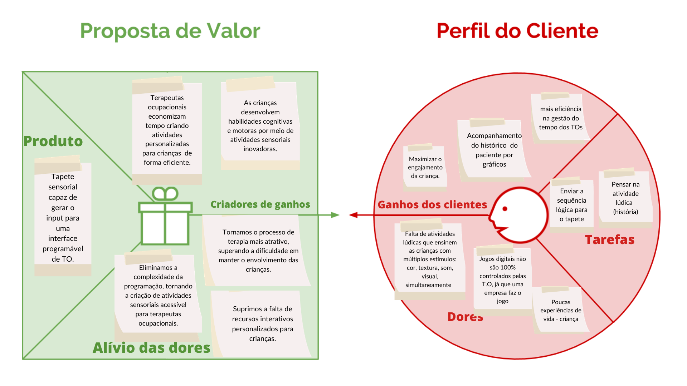
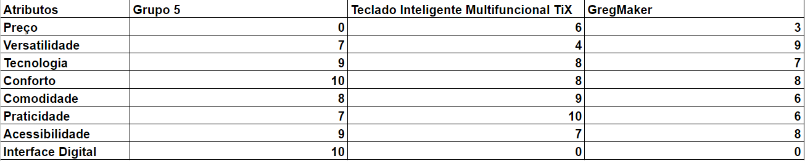
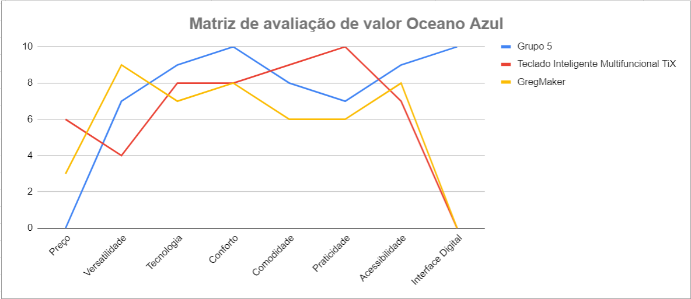
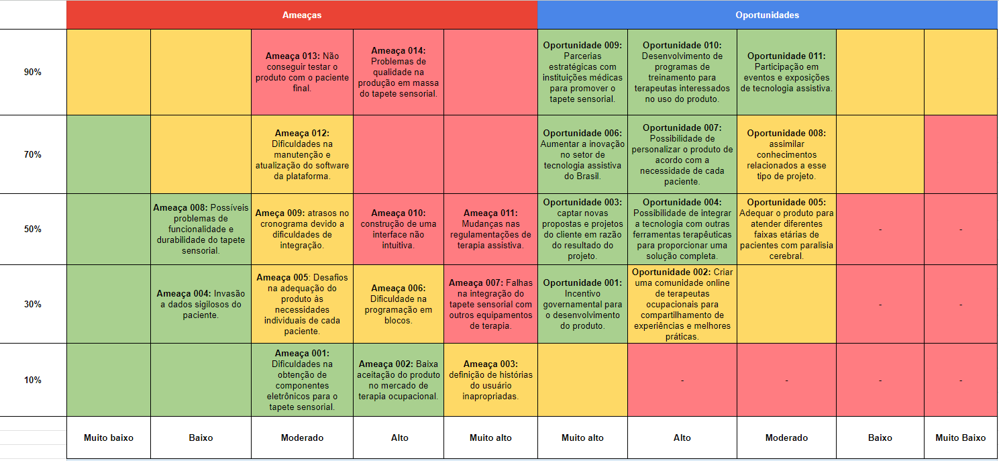

# Entendimento de negócio

## 1 Canvas Proposta de Valor

Logo abixo, temos uma análise da proposta de valor do nosso produto.

## 2 TAM, SAM e SOM

O estudo abaixo busca estimar o valor de mercado possível para um tapete sensorial integrado, um produto desenvolvido para proporcionar terapia assistiva a pessoas com leves desordens neurológicas na Associação de Assistência à Criança Deficiente (AACD). Vamos explorar os conceitos de Total Addressable Market (TAM), Service Addressable Market (SAM) e Service Obtainable Market (SOM) com base nos dados disponíveis.

### 2.1 TAM

Segundo dados fornecidos pela AACD, a população atendida abrange crianças e adolescentes (61%) e adultos (39%) com diversas desordens neurológicas, incluindo paralisia cerebral (PC), amputações, poliomielite, doenças neuromusculares, esclerose múltipla, lesões encefálicas adquiridas, lesão medular, mielomeningocele e malformações congênitas. É importante destacar que a paralisia cerebral, a maior causa de deficiência na infância, afeta 44% da população atendida na AACD. E focaremos nela para estimar a receita deste estudo. 
Segundo a Cerebral Palsy Alliance Research Foundation existem 17 milhões de pessoas com paralisia cerebral no mundo e usaremos esse dado para estimar nosso mercado total. Além disso, iremos precificar o nosso produto com base em nosso competidor direto Greg Maker, que fornece um dispositivo embarcado que pode ser configurado como se fosse um teclado e mouse. O nosso protótipo usa exatamente o produto Grag Maker e integra ele a uma interface própria. Ou seja, temos um produto muito parecido, mas que atende a uma necessidade específica da população com PC. Portanto, a nossa precificação será neste produto já desenvolvido, pois sabemos que é um valor que o mercado já está suscetível a pagar. Logo, iremos multiplicar a população total com PC, de 17 milhões de pessoas pelo valor cobrado no Brasil pelo Greg Maker, R$500,00. Com isso, chegamos a um TAM de R$8,5 bilhões.

### 2.2 SAM

Para calcular o SAM iremos nos basear no artigo Epidemiological characteristics of cerebral palsy in children and adolescents in a Brazilian northeast capital, de 2021, que demonstra que a estatística geral brasileira é de 1,37 crianças com PC a cada 1000 habitantes brasileiros. Além disso, iremos usar o dado do IBGE de que o Brasil possuía 203,1 milhões de habitantes em 2022. Com isso, chegamos ao montante de aproximadamente 292 mil brasileiros com PC. Contabilizando da mesma forma que o TAM, chegamos em R$146 milhões.

### 2.3 SOM

Por fim, para calcular a fatia de mercado que poderemos alcançar, de fato, podemos estimar, de forma mais conservadora, uma porção de 2% do mercado brasileiro. Diremos que essa estimativa será conservadora pelo fato de terem poucos concorrentes fornecendo soluções para este mercado, mesmo que exista um potencial público alvo grande. Sendo assim, temos um valor total de R$2,9 milhões. 

### 2.4 Conclusão
A análise do mercado para o Tapete Sensorial revela um grande potencial devido à alta demanda por terapia assistiva para pessoas com paralisia cerebral. Dados demográficos, capacidade operacional, estratégias de marketing e recursos financeiros são fatores críticos para determinar o SOM que podemos alcançar. A implementação bem-sucedida do produto pode beneficiar tanto os pacientes quanto a empresa, que busca sua missão de fornecer assistência de qualidade a pessoas com deficiência física. 

## 3 Matriz de Avaliação de Valor Oceano Azul
Esta ferramenta consiste em analisar o mercado em que uma empresa está inserida e quais são seus principais concorrentes usando quatro ações: reduzir, eliminar, aumentar e criar. Usando essas ações, é possível avaliar oportunidades de inovação e criar diferencial, o que leva a uma empresa a criar um novo mercado (chamado de oceano azul) e sair do mercado atual, onde há muitos concorrentes.
Para comparar as soluções atuais e a proposta para o projeto, o grupo criou uma Matriz de Avaliação de Valor Oceano Azul após fazer pesquisas e aprender sobre o produto. Uma análise com as informações a seguir está disponível: oito atributos de comparação: preço, versatilidade, tecnologia, conforto, comodidade, praticidade, acessibilidade e interface digital; três produtos concorrentes: Grupo 5, Teclado Inteligente Multifuncional TiX e GregMaker; e uma classificação de 0 a 10. Após a apresentação e explicação de cada característica, você pode ver um gráfico para obter uma compreensão visual da comparação dos três produtos concorrentes e as conclusões que o grupo chegou com base na avaliação realizada.

### Matriz Oceano Azul

A seguir, acompanhe a explicação sobre cada atributo; qual a ação que ele recebeu; e o motivo da nota recebida por cada uma das empresas:

### Preço

A avaliação do preço baseou-se nos valores encontrados nos sites de cada produto de tecnologia assistiva. As notas atribuídas a este atributo foram as seguintes: O Grupo 5 recebeu nota 0, pois isenta a AACD de pagar pela tecnologia assistiva. O Teclado Inteligente Multifuncional TiX recebeu nota 6 devido ao custo de R$4.680 para um tratamento de 24 meses. O GregMaker obteve nota 3, pois tem um custo de R$500 para o mesmo período. Levando em conta que quanto maior a nota mais caro é o produto.

### Versatilidade

A avaliação da versatilidade levou em consideração a capacidade de cada produto ser adaptado para executar tarefas específicas determinadas por um Terapeuta Ocupacional (T.O.). As notas atribuídas para este atributo foram as seguintes: O Grupo 5 recebeu nota 7, pois oferece programação em blocos de histórias terapêuticas. O Teclado Inteligente Multifuncional TiX recebeu nota 4, pois possui poucas oportunidades de programação, mas ainda é adaptável para uso versátil dentro de um computador. O GregMaker obteve nota 9 devido a sua alta capacidade de programação, permitindo versatilidade tátil quase infinita e sua utilização como base para outros projetos.

### Tecnologia

A avaliação da tecnologia foi baseada nas tecnologias suportadas e utilizadas em cada produto. As notas atribuídas para este atributo foram as seguintes: O Grupo 5 recebeu nota 9, pois utiliza tecnologias integradas e programáticas, além de uma linguagem compiladora intermediária, integração com aplicação web como ferramenta de gestão do produto e o uso de aprendizado de máquina para sugestão de fluxos de atividades terapêuticas. O Teclado Inteligente Multifuncional TiX obteve nota 8, uma vez que oferece tecnologia de fácil utilização com interface plug-and-play e visão computacional. O GregMaker recebeu uma nota menor, uma vez que não apresenta um diferencial tecnológico significativo em relação aos outros produtos, embora seja mais manipulável para aprimoramentos específicos.

### Conforto

A avaliação do conforto considerou o material do produto em contato com o usuário. As notas atribuídas para este atributo foram as seguintes: O Grupo 5 recebeu nota 10 por oferecer um tapete texturizado e sensível ao toque, assemelhando-se a diferentes objetos do cotidiano do paciente. Tanto o Teclado Inteligente Multifuncional TiX quanto o GregMaker utilizam materiais que não são confortáveis ao toque, como o plástico, uma vez que o foco desses produtos não está na sensação tátil, mas sim na funcionalidade.

### Comodidade

A avaliação da comodidade levou em consideração o affordance do produto, ou seja, a forma e os métodos de utilização do produto, levando em consideração as limitações do usuário. As notas atribuídas para este atributo foram as seguintes: O Grupo 5 recebeu nota 8, pois, embora seja intuitivo, requer uma maior amplitude e esforço nos movimentos de toque. O Teclado Inteligente Multifuncional TiX obteve nota 9, sendo um produto objetivo e fácil de usar, exigindo pouco esforço. O GregMaker recebeu nota 7, pois depende de diferentes objetos para ser utilizado, variando sua comodidade dependendo de como foi planejado para ser utilizado.

### Praticidade

A avaliação da praticidade considerou a facilidade de instalação e uso do produto. As notas atribuídas para este atributo foram as seguintes: O Grupo 5 obteve nota 7, uma vez que requer programação prévia e espaço adicional para alocar o produto. O Teclado Inteligente Multifuncional TiX recebeu nota 10, pois é fácil de ser usado e pode ser utilizado em diferentes sistemas e ambientes, sendo plug-and-play. O GregMaker obteve nota 6, uma vez que depende de configuração e preparação maiores em relação aos outros produtos para alcançar os mesmos níveis de estímulos.

### Acessibilidade

A avaliação da acessibilidade considerou a quantidade de recursos de estímulo oferecidos por cada uma das tecnologias para diferentes públicos dentro do público-alvo. As notas atribuídas para este atributo foram as seguintes: O Grupo 5 obteve nota 9, uma vez que oferece estímulos táteis, visuais e sonoros para a criança. O Teclado Inteligente Multifuncional TiX recebeu nota 7, oferecendo estímulos táteis e visuais. O GregMaker obteve nota 8, com estímulos táteis e visuais, mas com maior variedade de possibilidades em comparação com o TiX.

### Interface Digital

A avaliação da Interface Digital levou em consideração o sistema que suporta o uso do produto. As notas atribuídas para este atributo foram as seguintes: O Grupo 5 obteve nota 10, uma vez que é o único a fornecer uma interface digital programável de gestão para o Terapeuta Ocupacional, além de estímulos visuais para a criança através de um display. Tanto o Teclado Inteligente Multifuncional TiX quanto o GregMaker receberam nota 0, uma vez que não oferecem esse recurso, que é um dos principais diferenciais do produto do Grupo 5.

A seguir, é possível avaliar a comparação e seus atributos de forma visual, através de um gráfico de linhas.

### Aumentar:

* Conforto: Uma vez que o Grupo 5 recebeu a maior pontuação (nota 10) nesse atributo, ele se destacou acima dos outros dois produtos, por isso aumentou este atributo.

* Tecnologia: Uma vez que o Grupo 5 recebeu a maior pontuação (nota 9) nesse atributo, ele se destacou acima dos outros dois produtos, por isso aumentou este atributo.

* Acessibilidade: Uma vez que o Grupo 5 recebeu a maior pontuação (nota 9) nesse atributo, ele se destacou acima dos outros dois produtos, por isso aumentou este atributo.
  
### Eliminar:

* Preço: Levando em consideração que o Grupo 5 recebeu pontuação (nota 0) nula neste atributo, entende-se que ele eliminou os custos de desenvolvimento da solução, tornando-a gratuita.

### Criar:

* Interface Digital: O Grupo 5 possui uma interface digital altamente avaliada (nota 10). No entanto, o TiX e o GregMaker não oferecem esse recurso. Logo, o Grupo 5 inovou dentro da categoria de produtos de Tecnologia Assistiva Táteis. Deve-se considerar, expandir e aprimorar ainda mais a interface digital, tornando-a uma característica única e valiosa do produto.

### Reduzir:

* Nenhum atributo foi reduzido pelo produto Grupo 5.

Em resumo, a escolha entre esses produtos depende das prioridades e necessidades específicas. O Grupo 5 se destaca em termos de acessibilidade, conforto, tecnologia, interface digital e preço acessível. O Teclado Inteligente Multifuncional TiX oferece praticidade e comodidade, enquanto o GregMaker é altamente versátil e proporciona variedade de estímulos.

## 4 Matriz de Risco

**Ameaça 001:** O risco demonstrou ser relevante na situação da pandemia de Covid-19, como o mundo possui dependência na produção dos chips de poucos países, existe sempre a ameaça iminente da falta de acesso a esse tipo de componente. Para mitigar este aspecto, podemos fundamentar uma parceria com fornecedores locais, como na zona franca de Manaus, para que, pelo menos 30% da nossa produção seja interna. 

**Ameaça 002:** Por ser um produto inovador e necessitar de uma curva de aprendizado para a plataforma, pode existir resistência por parte dos terapeutas ocupacionais em adotar esse tipo de solução, pois ela demanda o investimento de dinheiro e tempo para ser usada. Uma solução para isso, é a produção de vídeos curtos e simples que ensinem as principais funções. 

**Ameaça 003:** Na construção da solução, não teremos acesso a uma das personas, o paciente do tratamento, por isso, teremos informações enviesadas por parte da terapeuta para as informações de como ele irá usar o produto, logo, temos uma ameaça de construir uma persona não ideal. Para mitigar este risco, podemos solicitar que a terapeuta selecione um voluntário que responda a um  formulário de forma anônima. 

**Ameaça 004:** Como estamos lidando com uma plataforma online e temos que armazenar dados sigilosos, as boas práticas de segurança serão implementadas em nosso desenvolvimento, contudo, estaremos suscetíveis ao ataque de hackers.

**Ameaça 005:** Existem pacientes com necessidades muito específicas, por exemplo, no caso de um paciente com paralisia cerebral grave, ele não teria movimentos motores voluntários, logo, ele não seria atendido pela nossa solução. Por isso, estamos limitando essa solução para pacientes com paralisia cerebral leve. 

**Ameaça 006:** Somos programadores e estamos acostumados com a lógica de programação, contudo, as TOs não. E, por isso, elas podem ter dificuldade em programar a nossa solução, mesmo que ela seja desenhada de forma intuitiva e não necessite de conhecimentos de programação. 

**Ameaça 007:** Pensando em todo o fluxo de tratamento do paciente, podemos ter algum tipo de dificuldade em integrar as informações que estamos produzindo a outras plataformas que eles já usam. Uma maneira de mitigar isso é usar sistemas mais genéricos, como PDFs e Excel. 

**Ameaça 008:** Por se tratar de um objeto físico real, o seu manuseio possibilita que o produto seja estragado. Para resolver isso, iremos sugerir que o tapete seja instalado em um ambiente fixo.

**Ameaça 009:** O projeto em questão é bastante complexo e tem diferentes etapas de desenvolvimento, por isso, é muito provável que alguma entrega seja atrasada. Para mitigar isso, iremos adotar a metodologia Scrum para sermos transparentes com relação aos prazos. 

**Ameaça 010:** Por seu uma plataforma que exige a construção de uma lógica e o envio desta lógica para o hardware do tapete, esse sistema pode ser complexo para quem já tem alguma dificuldade com meios eletrônicos. Para mitigar isso, adotaremos as heurísticas de Nielsen na construção de uma boa UX e, além disso, podemos produzir vídeos educacionais. 

**Ameaça 011:** Por trabalharmos com dados sigilosos na área da saúde, estamos sujeitos a mudanças na regulamentação. Por isso, vale a pena observar quais novas leis nessa área estão sendo votadas e quando o processo estiver perto de ser vigorado, atualizar o sistema para essa nova adequação. 

**Ameaça 012:** Como iremos desenvolver um MVP, cabe a AACD decidir se uma equipe técnica irá dar continuidade ao desenvolvimento deste produto. Para facilitar, iremos documentar todo o código e utilizar de microsserviços para garantir a atualização componentizada do produto. 

**Ameaça 013:** A possibilidade de testarmos o produto com o usuário final é quase que nula, por conta da legislação e práticas da AACD. Por isso, iremos enviar o protótipo para a terapeuta e pedir que ela forneça um feedback da sua utilização com a criança.

**Ameaça 014:** A forma como o tapete é produzido hoje é um processo manual artesanal. Não há escala neste tipo de processo, logo, teremos que estudar e identificar uma nova forma de produção que permita escala que possibilite que a qualidade seja alta. Uma forma de trabalhar isso, no início, é solicitar a ajuda das mães das crianças que, muitas vezes, possuem boas habilidades neste tipo de prática. 

## 5 Análise Financeira do Projeto

A análise financeira do projeto é um processo importante que envolve a avaliação e o estudo detalhado dos aspectos financeiros de um projeto ou investimento sugerido. Ela é essencial para tomar decisões informadas sobre a alocação de recursos e para determinar a viabilidade financeira de um projeto. A análise financeira de um projeto analisa vários fatores, incluindo custos, receitas, orçamento, retorno sobre o investimento e riscos financeiros. No entanto, a análise financeira deste projeto em particular tem um caráter acadêmico porque o Instituto de Tecnologia e Lideranças e seus alunos irão desenvolver o produto sem custo algum.

Iniciando pelo escopo do desenvolvimento, abordamos 6 conceitos principais, incluindo:

* Número de integrantes no time - O número de gerentes de projetos júnior na equipe.
* Disponibilidade em caixa da empresa para o custeio do projeto - Valor que o cliente está disposto a investir no projeto. Até o momento, não nos foi disponibilizado nenhum valor.
* Salário de cada desenvolvedor júnior - Baseado na média salarial de um gerente de projetos júnior, conforme informações disponíveis no site da <a href="https://www.glassdoor.com.br/Sal%C3%A1rios/desenvolvedor-j%C3%BAnior-sal%C3%A1rio-SRCH_KO0,20.htm#:~:text=A%20m%C3%A9dia%20salarial%20de%20Desenvolvedor,%24%201.025%20e%20R%24%207.362">Glassdoor</a>
* Horas totais - Considerando o plano da faculdade para este módulo e descontando os dias de encontros com o cliente e as Sprints Planning, temos 232h 30min disponíveis para a realização do estudo e desenvolvimento do projeto.
* Remuneração por hora - Com base no salário total de cada desenvolvedor (R$ 3250,00) e na quantidade total de horas trabalhadas em um mês (160h), a remuneração por hora para cada desenvolvedor júnior é de R$ 20,31.
* Custo dos dispositivos - Custo do hardware implementado, circuitos eletrônicos e elétricos e peças de microeletrônica.

### Tabela Resumida da Análise Financeira do Projeto
| Item | Descrição| Valor |
| - | - | - |
| Remuneração por hora | Salário total / horas totais | R$ 20,31 |
| Time de Desenvolvimento | Custo de um time 7 desenvolvedores júnior por um período de 232h 30min | R$ 33.054,49 |
| GregMaker | Dispositivo de Tecnologia Assitiva Tátil | R$ 500,00 |
| Tapete Sensorial | Tapete de tecido com diferentes blocos de estímulos | R$ 370,00 |
| Recursos Extras | Sensores, Fios e Microeletrônicos | R$ 100,00 |
| Custo Total | Soma de todos os custos | R$ 34.024,49 |

#### Considerações Adicionais
É importante ressaltar que a receita gerada pelo projeto em um ano não foi estimada nesta análise, pois está fora do escopo do projeto e depende de fatores externos. Recomendamos uma análise adicional para estimar a receita gerada pelo projeto e avaliar seu impacto financeiro no longo prazo. Entretanto, podemos estimar que este projeto pode gerar resultados e consequentemente trazer investimentos para a instituição da AACD através de outros patrocínios e doações.

Além disso, a disponibilidade em caixa da empresa para o custeio do projeto não foi fornecida pela AACD. Entretanto, nesse caso, essa informação não inviabiliza a realização do projeto, justamente pois se trata de uma doação realizada pela instituição através de um produto desenvolvido pelo Grupo 5.

Por fim, é importante notar que a análise financeira é somente uma estimativa de gastos, necessária para avaliar a viabilidade do projeto.
